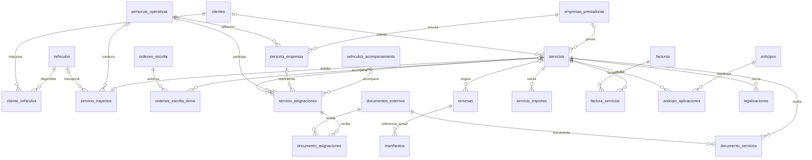
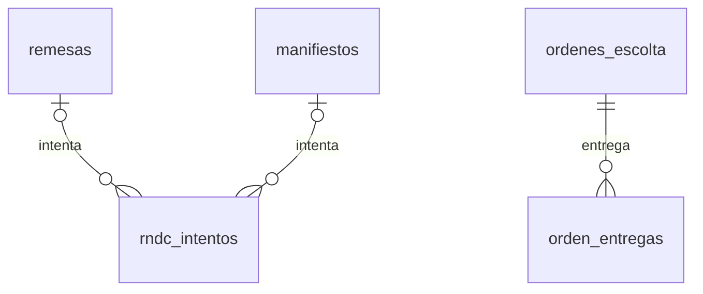

# Definición de base de datos TEG — versión 1.1

Propuesta de contrato de datos para revisión, basada en el DDL aportado y el proyecto local. No contiene órdenes de ejecución ni modifica la base remota. Complementa `docs/flujo-operativo-teg.md`. Los estados y nombres técnicos que no fueron confirmados por TEG son decisiones propuestas para implementación.

### Procedencia de reglas y decisiones técnicas

Las dudas iniciales sobre DIG, PESO y PR/PA fueron resueltas por un mensaje posterior del usuario en esta conversación, que presentó estas definiciones como «regla de negocio confirmada por TEG». No se dedujeron del número de filas ni de los ejemplos del archivo:

| Concepto | Confirmación expresa del usuario | Propuesta técnica, distinta de la confirmación |
| --- | --- | --- |
| DIG | «Indicador de digitación/control. OK indica que está correctamente digitado/revisado.» | Catálogo PENDIENTE/OBSERVADO/REVISADO, responsable, fecha e invalidación por cambios. Estos mecanismos aún son propuestas de implementación. |
| PESO | «Peso de la carga expresado en toneladas. Ej.: 18 = 18 toneladas.» | Columna numeric(12,3), precisión, validación positiva y conversión derivada a kg. La unidad está confirmada; los detalles de almacenamiento son propuestos. |
| PR/PA | «PR = Propio» y «PA = Particular / tercero (otra empresa)»; el usuario indicó que ya no debía quedar pendiente. | `service_type` con valores PROPIO/TERCERO y CHECK, obligatoriedad al aprobar y compatibilidad de históricos. El mapeo fue confirmado; su implementación aún no se ejecutó. |

Por tanto, estas tres semánticas permanecen confirmadas según el historial disponible. No se interpretan como «PA = pagado». La revisión posterior cuestiona su procedencia, pero no proporciona una definición comercial sustitutiva. Antes del DDL se revisan las propuestas técnicas y se mantiene nullable la captura incompleta; no se reclasifican históricos sin evidencia. Si TEG revoca una regla confirmada, se registra explícitamente la sustitución antes de implementar.

El rango declarado de la hoja llega a 8847, pero se identificaron diez filas de ejemplo con contenido además de la cabecera; no se analizaron 8846 operaciones.

## 1. Unidad de registro

**Un servicio es un trayecto o una prestación facturable concreta.** Tiene UUID interno y folio propio. Una orden autoriza varios servicios. Dos órdenes de escoltas distintas pueden acompañar el mismo servicio. Por eso la orden no debe ser la tabla principal del reporte.

El Excel tendrá una fila por servicio exportable. Los desplazamientos incluidos en una mensualidad pueden ser servicios hijos operativos con `exportable = false`; su costo queda en la mensualidad, salvo cobro adicional explícito. Así no se duplica facturación y se pueden seguir los desplazamientos reales. La carga movilizada se calcula sobre trayectos confirmados, no sumando mensualidad y trayectos como si fueran cargas distintas.

La relación remesa-manifiesto del diagrama representa el esquema actual, que permite varias filas de manifiesto para una remesa. El servidor debe controlar cuál documento está vigente. La agrupación de varias remesas en un manifiesto se reserva para una fase posterior; no se introduce una segunda tabla de relación que compita con `manifiestos.remesa_id` en esta versión.

Las cardinalidades opcionales representan captura incompleta en borrador. En particular, una asignación puede reservar «escolta 2» sin persona en estado RESERVADA; para CONFIRMADA o FINALIZADA exige persona y afiliación. Una reserva nunca cuenta como acompañante confirmado ni permite emitir una remisión nominal. Las relaciones con clientes, vehículos y conductor también se completan antes de la transición que las requiera. `cliente_vehiculos` expresa disponibilidad comercial, no propiedad.

Vista de envío y recuperación (complementa el diagrama de negocio):

Cada intento referencia **exactamente una** remesa o un manifiesto (XOR mediante CHECK); las dos relaciones opcionales no permiten un intento huérfano. La idempotencia requiere además transacciones, bloqueo de intentos concurrentes y conciliación: el registro de logs por sí solo no evita duplicados.

## 2. Convenciones

- PK `uuid default gen_random_uuid()`. FK históricas con `ON DELETE RESTRICT` salvo justificación específica. Baja lógica; no borrado de documentos emitidos.
- Fechas comerciales: `date`. Eventos: `timestamptz`; presentar en America/Bogota. Fecha real de transporte, fecha de orden, solicitud y factura permanecen separadas.
- Importes: `numeric(14,2)`. Peso: `numeric(12,3)` toneladas. No usar float para dinero. Referencias, documentos, OS, códigos y placas son texto, aunque solo contengan dígitos.
- Filas operativas mutables: `created_at`, `updated_at`, `created_by`, `updated_by`, `version integer default 1`. Actor obtenido de identidad verificada por servidor. Actualizaciones con versión esperada; incrementar en servidor para detectar concurrencia.
- Catálogos cerrados pequeños mediante CHECK. Datos desconocidos: NULL, sin inventar cero, guiones, fechas ni clasificación por defecto. Pendiente y no aplica son situaciones distintas.
- Snapshots documentales se fijan al confirmar/emitir. Una FK permite navegar al maestro actual; no reemplaza el nombre, placa o identificación histórica del documento.
- Las reglas que dependen de varias tablas se hacen cumplir en transacciones/funciones del servidor y, donde sea viable, triggers. Un CHECK solo valida datos de la misma fila; no asegura sumas entre movimientos.

## 3. Tablas existentes que se conservan

| Tabla | Cambio propuesto |
| --- | --- |
| `users` | Mantener UUID y FK; agregar `auth_user_id uuid unique` nullable durante transición, referenciado a `auth.users`. Ampliar rol cuando API y Flutter lo soporten. Retirar contraseña después de migrar identidad. |
| `clientes` | Conservar datos actuales y snapshots al documentar. No convertir cliente en empresa prestadora por defecto. |
| `cliente_vehiculos` | Conservar relación comercial; no prueba propiedad del vehículo. |
| `vehiculos` | Mantener identificación de vehículos RNDC. No obligar a que el vehículo de escolta tenga todos los campos RNDC de camabaja. |
| `escoltas` | Conservar IDs, nombres y placas históricos. Agregar `persona_id` nullable para separar persona de vehículo en la nueva operación. |
| `ordenes_escolta` | Mantener consecutivo, snapshots, firma/PDF y estados de envío actuales. Agregar ciclo de vida y referencia a versión anterior sin sustituir documentos firmados. |
| `ordenes_escolta_items` | Agregar `servicio_id uuid` nullable durante migración y `observaciones text`. Mantener máquina/origen/destino como contenido de la orden. Agregar UNIQUE `(id, servicio_id)` para vínculos coherentes. |
| `remesas` | Agregar `servicio_id uuid` nullable. Mantener consecutivo, radicado, XML depurado y peso en kg. No reconstruir una remesa aceptada desde el servicio actualizado. |
| `manifiestos` | Conservar FK a remesa, consecutivo, valores pactados y resultados. Su servicio se obtiene por la remesa, sin otra FK redundante. |
| `settings` | Conservar configuración. Auditar generación atómica de consecutivos y el default de simulación antes de modificar. |
| `dispatches`, `dispatches_view` | Conservar hasta revisar consumidores e históricos. La futura vista TEG no reemplaza automáticamente estas interfaces. |

## 4. Núcleo operativo

### `servicios`

| Campo | Tipo / regla |
| --- | --- |
| `id`, `folio` | UUID PK; bigint identity UNIQUE como folio interno, independiente de COD INT y numeración RNDC. |
| `codigo_interno` | text nullable; referencia COD INT no única. |
| `cliente_id` | FK clientes; puede faltar en borrador, obligatorio para revisión aprobada. |
| `cliente_nombre_snapshot`, `cliente_documento_snapshot` | text; confirmar al aprobar y conservar versiones al corregir. |
| `service_type` | text CHECK IN ('PROPIO','TERCERO'); nullable en borrador/migración. Exportar PR/PA. |
| `empresa_prestadora_id` | FK empresas_prestadoras; obligatorio al aprobar TERCERO. PROPIO identifica a TEG mediante configuración de empresa. |
| `tipo_prestacion` | text controlado: TRANSPORTE, ACOMPANAMIENTO, TECNICO, TURNO, HORA_ADICIONAL, MENSUALIDAD. Nullable en borrador. Catálogo propuesto. |
| `servicio_padre_id` | FK servicios nullable, CHECK diferente de id. Validación transaccional impide ciclos. |
| `exportable` | boolean; true para prestaciones de la fila TEG, false para detalle incluido en otra prestación. Cambios solo administrativos y auditados. |
| `concepto` | text: descripción comercial para TIPO DE CARGA. Distinto de código RNDC. |
| `fecha_solicitud`, `fecha_prevista`, `fecha_transporte` | date nullable; última confirmada con ejecución. |
| `periodo_inicio`, `periodo_fin` | date, pareja completa o ambos NULL; fin >= inicio. Mensualidad exige período al aprobar. |
| `programa`, `obra`, `os_numero`, `cotizacion_referencia` | text nullable. |
| `estado_os` | text de catálogo por definir; conservar valor legado en `estado_os_original` al migrar. |
| `tratamiento_documental` | PENDIENTE, RNDC_PROPIO, EXTERNO, NO_APLICA. Default PENDIENTE. Independiente de PR/PA. |
| `motivo_tratamiento`, `clasificado_por`, `clasificado_at` | Justificación y auditoría; requeridos para EXTERNO/NO_APLICA aprobados. |
| `estado_operativo` | BORRADOR, EN_REVISION, DEVUELTO, REVISADO, PROGRAMADO, EN_EJECUCION, EJECUTADO, CERRADO, CANCELADO. |
| `observaciones` | text operativo, distinto de nota administrativa. |
| `motivo_cancelacion` | requerido al cancelar; conserva relaciones y documentos. |

No inferir EXTERNO por ser PA ni RNDC_PROPIO por ser PR. El administrativo valida responsabilidad documental. Revisión exige cliente, clasificación y mínimos del tipo; el borrador permite captura gradual.

### `servicio_trayectos`

PK/FK `servicio_id`: relación 0..1 por servicio. Si hay tres recorridos independientes, crear tres servicios.

| Campo | Tipo / regla |
| --- | --- |
| `maquina` | text; TIPO DE CARGA (ESCOLTA). |
| `origen`, `destino` | text, sitio/dirección, separado de municipio. |
| `origen_municipio_dane`, `destino_municipio_dane` | text validado con catálogo; no inventar conversiones a partir de dirección libre. |
| `peso_toneladas` | numeric(12,3), NULL o > 0; dato operativo. |
| `peso_confirmado_por`, `peso_confirmado_at` | ambos presentes o ausentes; confirmar requiere peso. Una modificación invalida la confirmación. |
| `peso_kg` | derivado `peso_toneladas * 1000`; no editable. Para remesa crear snapshot validado en sus campos actuales. |
| `vehiculo_id` | FK vehiculos nullable. |
| `conductor_persona_id` | FK personas_operativas nullable. |
| `conductor_nombre_snapshot`, `conductor_documento_snapshot` | text, preservar identificación validada. |
| `placa_camabaja_snapshot`, `placa_remolque_snapshot` | text; no exigir FK de remolque hasta comprobar catálogo disponible. |

Para transporte revisado exigir recorrido y datos validados según operación; para un servicio por período no crear trayecto ficticio. 18 toneladas producen 18000 kg; los históricos de `remesas.peso_kg` ya están en kg.

### Personas y vehículos de acompañamiento

`personas_operativas`: id, nombre, tipo_documento, documento, telefono, activo y auditoría. Identificación única por tipo/documento cuando existe; no deduplicar por nombre. `persona_funciones(persona_id, funcion)` con PK compuesta y función ESCOLTA, TECNICO o CONDUCTOR. Una persona puede realizar más de una función.

`users.persona_id` FK UNIQUE nullable vincula una cuenta con persona operativa. Un usuario administrativo puede no tener persona operativa. `escoltas.persona_id` mantiene compatibilidad; no fusionar registros históricos por compartir placa sin revisión.

`vehiculos_acompanamiento`: id, placa UNIQUE normalizada, activo y auditoría. Separado del vehículo de carga RNDC. Las placas actuales de escoltas se importan a este catálogo sin eliminar la información original.

`empresas_prestadoras`: id, nombre, tipo_documento, documento, digito_verificacion, activo y auditoría; UNIQUE tipo/documento. Incluye a TEG y a terceros prestadores, sin depender de que sean clientes. La configuración identifica la fila de TEG; no crear una empresa ficticia para una afiliación desconocida.

`persona_empresas`: id, persona_id FK NOT NULL, empresa_id FK NOT NULL, desde date NOT NULL, hasta date nullable y auditoría. Intervalo [desde, hasta), con hasta > desde; impedir intervalos superpuestos para una misma pareja persona/empresa. Modela afiliación operativa sin afirmar una relación laboral. Puede haber vínculos con varias empresas: cada asignación elige bajo cuál actúa la persona. Una afiliación desconocida permanece pendiente y no se clasifica automáticamente como propia.

La asignación guarda `persona_empresa_id` y snapshots de nombre/documento de la empresa al confirmar. FK compuesta `(persona_empresa_id, persona_id)` hacia UNIQUE `(id, persona_id)` de `persona_empresas` garantiza correspondencia. El servidor valida cobertura temporal de la afiliación para la asignación. Cerrar una afiliación no modifica documentos pasados; una corrección retroactiva requiere revisión de asignaciones afectadas y conserva auditoría.

Se **mantiene** `servicios.empresa_prestadora_id`: identifica al prestador responsable del servicio completo. La empresa del escolta o técnico se obtiene de su asignación y puede ser diferente. Por ejemplo, un servicio propio TEG puede contar con un escolta de otra empresa sin convertirse automáticamente en PA.

### `servicio_asignaciones`

Campos: id, servicio_id FK, persona_id FK nullable en RESERVADA, persona_empresa_id FK nullable en RESERVADA, estado (RESERVADA/CONFIRMADA/FINALIZADA/CANCELADA), funcion (ESCOLTA/TECNICO), posicion integer > 0, vehiculo_acompanamiento_id FK nullable, orden_item_id nullable, nombre_snapshot, placa_snapshot, empresa_nombre_snapshot, empresa_documento_snapshot, vigente boolean, fecha_inicio/fin y auditoría. Las referencias externas se guardan mediante `documento_asignaciones`, sin duplicar el número en una columna libre.

Restricciones:

- CHECK: CONFIRMADA/FINALIZADA exige persona_id y persona_empresa_id no NULL. CANCELADA puede conservar una reserva sin persona; ninguna asignación cancelada puede ser vigente. `vigente` indica la versión aplicable para consulta histórica/exportación, no que la persona siga trabajando hoy.
- UNIQUE parcial `(servicio_id, funcion, posicion)` WHERE vigente. ESCOLTA posición 1 y 2 alimentan Excel; admitir más para no perder datos y marcar límite de exportación.
- UNIQUE parcial `(servicio_id, funcion, persona_id)` WHERE vigente y persona_id no NULL. La misma persona puede ser escolta y técnico, pero no dos escoltas simultáneos del mismo servicio.
- FK compuesta `(orden_item_id, servicio_id)` → ítems `(id, servicio_id)` impide vincular una orden de otro servicio. Un ítem debe vincularse antes de crear esa asignación.
- Remisión principal interna (`orden_item_id`) o externa (`documento_asignaciones`), sin ambas fuentes principales simultáneas. Validar en transacción con bloqueo de la asignación; documentos secundarios/históricos pueden conservarse. Una reserva sin persona no puede tener remisión nominal validada ni orden nominal confirmada. La referencia externa queda validada por administrativo.
- Reasignar conserva fila anterior como no vigente. Si existen costos aprobados o documentos firmados, una reasignación requiere revisión y nueva versión: no trasladar importes o firmas silenciosamente.

## 5. Documentación y control

### Documentos internos y externos

Remesas internas se crean por `servicio_id`, manteniendo UUID, consecutivo y radicado distintos. Propuesta de `remesas.vigente boolean`: NULL para históricos no conciliados, true/false para registros vinculados. Índice único parcial por servicio WHERE vigente IS TRUE. Revisar duplicados antes de poblar; la vigencia se cambia en transacción con motivo. Un documento aceptado no se reemplaza sin resolver su situación documental.

Para manifiestos, aplicar el mismo control de documento vigente por remesa en la primera versión. Esto no equivale a permitir varias emisiones activas por cambiar un booleano: el servidor valida los estados y procesos aplicables.

`documentos_externos`: cabecera id, tipo (REMESA/MANIFIESTO/REMISION_ESCOLTA/REMISION_TECNICO/OTRO), empresa_emisora_id FK, numero text, fecha date, radicado text nullable, autorizacion text nullable, estado (BORRADOR/VALIDADO/ANULADO), validado_por/at y auditoría. UNIQUE `(empresa_emisora_id, tipo, numero)`; conservar versiones y correcciones sin duplicar su identidad. Son referencias verificadas, no se envían para reemitirlas.

Dos tablas dan un destino explícito al documento:

- `documento_servicios`: id, documento_id FK, servicio_id FK, tipo_documento, vigente. UNIQUE documento/servicio y UNIQUE parcial servicio/tipo WHERE vigente para REMESA/MANIFIESTO. FK compuesta documento/tipo contra cabecera impide falsear el tipo. Las remisiones nominales no usan este vínculo.
- `documento_asignaciones`: id, documento_id FK, asignacion_id FK, tipo_documento, vigente. UNIQUE documento/asignación; una remisión principal vigente por asignación. FK compuesta documento/tipo y validación de función: REMISION_ESCOLTA solo ESCOLTA, REMISION_TECNICO solo TECNICO. El servicio se obtiene desde la asignación, evitando una segunda FK que pueda contradecirla.

Una cabecera puede cubrir varios servicios o asignaciones, sin copiar el número varias veces en el maestro. Al validar exigir al menos un vínculo del tipo correcto y los responsables requeridos; prohibir vínculos cruzados incompatibles mediante validación transaccional/trigger. Emisor y empresa de afiliación pueden diferir: registrar ambos sin asumir equivalencia.

REMISION ESC 1/2 y REMISION TECNICO se obtienen de la asignación vigente por función/posición, y de su orden interna o remisión externa principal. No buscar «el primer documento del servicio». Si un documento incluye varios acompañantes, solo vincularlo con los que efectivamente identifica.

`documento_externo_archivos`: id, documento_id FK, storage_path privado, checksum, mime_type, tamano_bytes > 0, cargado_por/at. Sustituye el soporte_id ligado a un único servicio para estas cabeceras compartidas. Acceso por vínculos autorizados; un documento compartido requiere revisar si revela datos ajenos antes de conceder descarga al escolta. El archivo no se hace público por estar vinculado a una asignación.

### `rndc_intentos`

Campos: id; remesa_id o manifiesto_id (exactamente una FK presente); proceso text validado en servidor; version_documento integer; idempotency_key uuid UNIQUE; payload_hash text; estado (PREPARADO/ENVIANDO/ACEPTADO/RECHAZADO/POR_VERIFICAR); radicado text; codigo_error text; detalle_error text; `xml_solicitud_depurado` y `xml_respuesta_depurado`; iniciado_at, terminado_at; created_by.

Unicidad parcial por documento/proceso para PREPARADO, ENVIANDO y POR_VERIFICAR; un resultado incierto bloquea otro envío hasta conciliar. La misma clave idempotente con otro hash devuelve conflicto. Una corrección legítima crea otra versión/intento después de un rechazo explícito o conciliación. Nunca persistir contraseñas dentro del XML.

### `servicio_controles`

PK/FK servicio_id; `digitacion_estado` (PENDIENTE/OBSERVADO/REVISADO), digitacion_por/at, digitacion_observacion; verificacion_resultado text, verificacion_por/at, verificacion_observacion; nota_administrativa text; auditoría.

DIG exporta OK solo para REVISADO con autor/fecha. Una modificación relevante invalida ese control. VERIFICACION conserva su finalidad confirmada, pero no se inventa un catálogo aprobado. RNDC se proyecta desde documentos e intentos; falta definir cómo resumir varios procesos en una celda.

### Soportes, eventos y entrega

`servicio_soportes`: id, servicio_id, tipo, storage_path, mime_type, tamano_bytes > 0, checksum, cargado_por/at. Bucket privado, descarga autorizada y sin URL pública permanente. Relacionar al documento/evento cuando corresponda.

`servicio_eventos`: id, servicio_id, tipo_evento, ocurrido_at, registrado_at, actor_id, version, detalle depurado. Inmutable para usuarios operativos. Registrar ejecución, novedades y cambios de estado sin incluir secretos.

`orden_entregas`: orden_id FK, version_orden, tipo PDF/CORREO, estado, clave_idempotente UNIQUE, intentos, error, siguiente_intento_at. El trabajo usa la orden ya reservada. Firma y PDF tienen identidad/versionado propio; reintentar correo no crea orden ni nueva firma.

## 6. Datos económicos separados

### `servicio_importes`

Se usa este nombre para no afirmar aún que todos los valores sean costos o ingresos. Campos: id, servicio_id, version, vigente, moneda (COP inicialmente), valor_flete, valor_tecnico, valor_escolta_1, valor_escolta_2, tecnico_aplica/escolta_1_aplica/escolta_2_aplica/flete_aplica (boolean nullable), asignacion_tecnico_id/escolta_1_id/escolta_2_id, aprobado_por/at y auditoría.

Cada importe es NULL o >= 0. Si aplica=true se exige importe al aprobar; false exige motivo y aporta cero al cálculo; NULL indica sin clasificar y deja total pendiente. El total es derivado de los cuatro componentes, sin usar COALESCE global para ocultar faltantes. Un cero explícito sigue siendo válido cuando esté confirmado.

UNIQUE servicio/version y UNIQUE parcial servicio WHERE vigente. Una versión aprobada es inmutable; correcciones crean versión nueva. Validar que las asignaciones corresponden al servicio y posición/función, mediante FK compuestas o validación transaccional. Solo administrador escribe o aprueba.

**No sincronizar automáticamente** `valor_flete` con `remesas.valor_flete` ni `manifiestos.valor_viaje`: la equivalencia comercial está pendiente. Los importes pactados del manifiesto requieren aprobación propia, con versión y aprobador, antes de emisión. El administrativo recibe únicamente esos valores autorizados necesarios para el documento.

### Facturas

`facturas`: id, emisor_documento, numero, fecha, moneda, estado (BORRADOR/REGISTRADA/ANULADA), soporte_id y auditoría; UNIQUE emisor_documento/numero.

`factura_servicios`: id, factura_id, servicio_id, vigente, importe_asignado y auditoría. UNIQUE factura/servicio; una factura vigente por servicio para primera exportación. Sumar asignaciones, sin repetir el total de la factura por cada servicio. Las referencias a facturación externa no implican emisión fiscal desde esta app.

### Anticipos y legalizaciones

`anticipos`: id, referencia, fecha, beneficiario, valor numeric(14,2) > 0, moneda, soporte_id, estado y auditoría.

`anticipo_aplicaciones`: id, anticipo_id, servicio_id, valor_aplicado > 0, estado y auditoría; UNIQUE anticipo/servicio. Transacción bloquea la cabecera antes de comprobar que suma activa <= valor del anticipo. Esto también debe probarse con dos solicitudes concurrentes.

`legalizaciones`: id, servicio_id, referencia, fecha, estado, soporte_id, verificado_por/at y auditoría. `legalizacion_detalles`: id, legalizacion_id, anticipo_aplicacion_id nullable, concepto, valor, soporte_id. Una aplicación puede distribuirse en detalles sin superar su monto; bloquear la aplicación al validar suma. El detalle debe pertenecer al mismo servicio que la legalización. Ajustes con motivo y trazabilidad, sin borrar movimientos cerrados.

Registrar múltiples anticipos/legalizaciones aunque el Excel tenga una sola casilla de fecha/número. El exportador señala el caso pendiente de regla de representación; no usa MIN/MAX o primer registro silenciosamente. LEG No sigue como referencia provisional hasta confirmar su significado.

## 7. Acceso y propiedad

| Grupo de datos | Escolta | Administrativo | Administrador |
| --- | --- | --- | --- |
| Servicio/orden propia o asignada | Lectura operativa; captura propia según estado | Lectura y revisión | Gestión |
| Órdenes/servicios ajenos sin asignación | Denegado | Lectura y revisión | Gestión |
| Catálogos | Proyección mínima para captura | Gestión operativa autorizada | Gestión |
| Remesas/manifiestos e intentos | Sin acceso directo | Operaciones autorizadas | Gestión |
| Importes, facturas, anticipos, legalizaciones | Denegado | Solo valores aprobados necesarios para emitir | Gestión |
| Usuarios, roles y secretos | Solo perfil propio sin secretos | Solo perfil propio | Gestión mediante API |
| Controles administrativos | Sin edición | Digitación/revisión operativa | Verificación/cierre |

Mantener auditor existente con permisos de lectura explícitos; no asignarle finanzas automáticamente. Role desconocido o cuenta inactiva: denegar.

Diseño de seguridad: Supabase Auth y RLS para acceso directo que permanezca habilitado; API valida JWT y consulta perfil activo. `users.id` histórico se resuelve mediante `auth_user_id = auth.uid()`, no se compara a ciegas con auth.uid(). El backend con service_role evita RLS: debe comprobar autorización y propiedad en cada operación y no exponer endpoints genéricos de tabla/rol/propietario.

Crear tablas nuevas con RLS habilitada y sin permisos amplios por defecto. Políticas específicas se implementarán y probarán con el backend identificado. No habilitar RLS sobre las tablas antiguas sin migrar consumidores, ni publicar el esquema nuevo con políticas universales para evitar errores. No se afirma que las políticas actuales desplegadas sean iguales al SQL local.

## 8. Exportación e índices

`modelo_teg_view` será una proyección de lectura administrativa con las 44 columnas del documento de flujo. Resolver una fuente vigente por documento, una asignación por posición y una versión de importes antes de unir. Agregar movimientos en consultas separadas; comprobar una fila por servicio exportable.

El servicio de exportación distingue pendiente, no aplica y confirmado. Fechas e importes permanecen tipados; guiones se añaden únicamente como presentación cuando el formato lo exija. Para información aún ambigua, devolver faltantes concretos en vez de fabricar datos.

Índices mínimos: todas las FK de búsqueda frecuente; servicios `(estado_operativo, created_at)`, `(created_by, created_at)`, `(cliente_id, fecha_transporte)` y `(service_type, fecha_transporte)`; asignaciones `(persona_id, servicio_id)` WHERE vigente; ítems `(servicio_id)`; remesas `(servicio_id)`; eventos `(servicio_id, ocurrido_at)`; intentos por documento/proceso/estado; índices únicos parciales de vigencia descritos. Revisar consultas reales antes de añadir más.

## 9. Migración y reversión planificadas

1. **Inventario de solo lectura:** esquema real, FK, índices, RLS, grants, funciones, duplicados y consumidores del backend. Respaldo y restauración comprobada antes de producción.
2. **Identidad:** preparar vínculo a Auth y nuevos roles sin borrar usuarios, alterar contraseñas históricas ni mapear operator a un rol nuevo automáticamente. Retirar acceso antiguo después de validar.
3. **Expansión:** crear tablas nuevas y FK nullable en tablas existentes, sin recalcular numeración ni tocar documentos emitidos. Migración transaccional versionada y revisada contra inventario.
4. **Carga histórica:** tabla de correspondencias `migracion_vinculos` con origen_tabla/origen_id UNIQUE, destino_servicio_id, metodo, revisado_por/at. Crear candidatos por ítem y revisar coincidencias entre órdenes; no fusionar recorridos por similitud solamente.
5. **Conciliación:** remesas/manifiestos/documentos externos sin evidencia quedan sin vincular. Conservar estados, IDs, snapshots y peso histórico en kg. Poblar vigencias solo después de revisar duplicados.
6. **Integración:** API y Flutter escriben por el nuevo contrato, con validación de permisos, versiones e idempotencia. Mantener lecturas antiguas durante transición.
7. **Restricciones definitivas:** endurecer requisitos para nuevos registros y retirar columnas/interfaces legadas únicamente cuando no haya consumidores. No borrar `dispatches` ni sustituir `dispatches_view` en esta fase.

Reversión de expansión antes de uso: documentar objetos creados, retirar solo objetos nuevos vacíos tras comprobar dependencias y conservar respaldo. Después de uso: desactivar nuevas escrituras/rutas y conservar tablas y datos; corrección hacia adelante. No hacer un DROP general, reiniciar secuencias ni regresar a acceso inseguro para revertir identidad.

Los scripts ejecutables de migración, reversión y políticas se preparan contra el esquema verificado. Esta definición no pretende ser un SQL listo para ejecutar sin inspeccionar el backend.

## 10. Pruebas obligatorias antes de aplicar

- Aceptar PROPIO/TERCERO; rechazar otros códigos en aprobación; PR/PA no modifica automáticamente tratamiento documental.
- Convertir 18 t → 18000 kg sin reconvertir los históricos que ya estaban en kg.
- Tres ítems crean/vinculan tres servicios; dos escoltas de un servicio producen una fila y un peso movilizado.
- Rechazar asignación con ítem de otro servicio, posición vigente duplicada y ciclo padre/hijo.
- Permitir reserva sin persona; rechazar confirmación/remisión nominal sin persona y afiliación válidas.
- Mantener servicio PR cuando participa un escolta de tercero; conservar empresa histórica al cambiar afiliación.
- Vincular cada remisión externa con escolta 1, escolta 2 o técnico correctos; rechazar función incompatible y dos remisiones principales simultáneas.
- Compartir cabecera documental sin multiplicar servicios, costos o peso; rechazar intento RNDC con ambas FK o ninguna.
- NULL económico deja total pendiente; componente no aplicable aporta cero solo después de clasificación explícita.
- Rechazar escritura financiera del escolta y del administrativo, lectura ajena del escolta y elevación de rol desde cliente; permitir operaciones propias autorizadas.
- Dos aplicaciones concurrentes de un anticipo no superan el saldo; legalización no mezcla servicios.
- Doble envío y timeout mantienen un documento/intento lógico; PDF/correo reutilizan orden.
- Emitidos y aprobados conservan snapshots e historial; cambios operativos invalidan revisión aplicable.
- Conteo de filas exportadas coincide con servicios exportables; documentos/anticipos múltiples no multiplican fletes ni peso.

Pendientes comerciales acotados: MTO, LEG No, equivalencia del flete, resumen de RNDC, criterios de VERIFICACION y representación múltiple en Excel. No bloquean el núcleo de servicios, roles y trazabilidad; sí bloquean automatizar sus equivalencias y cierre final.

## 11. Primer incremento de construcción y prueba

No construir todas las tablas simultáneamente. El primer resultado verificable será **guardar una orden con varios viajes, recuperarla tras un fallo y mostrar los mismos servicios al administrativo sin duplicarlos**.

1. **Preparar el entorno:** ubicar el backend, inventariar esquema/funciones/permisos en solo lectura y disponer de PostgreSQL/Supabase local o de desarrollo. No aplicar este documento como si fuera una migración. Crear fixtures sintéticos y mecanismo de migración/reversión antes de tocar datos reales.
2. **Resolver identidad y autorización mínima:** verificar token, usuario activo y capacidades escolta/administrativo/admin en servidor. Cuentas de prueba sin secretos reales. Probar denegación de rol falso, usuario inactivo y acceso a operación ajena. No liberar la captura nueva con acceso anónimo amplio mientras se prepara la identidad definitiva.
3. **Crear el núcleo mínimo:** `servicios`, `servicio_trayectos` y el vínculo nullable `ordenes_escolta_items.servicio_id`, conservando órdenes e ítems existentes. Crear una clave idempotente persistente de reserva con unicidad y hash del contenido; su ubicación concreta en orden o registro de solicitudes se decide contra el contrato del backend. La reserva guarda cabecera, ítems y servicios en una sola transacción.
4. **Exponer dos operaciones de API:** reservar/recuperar la orden por clave idempotente y listar sus servicios pendientes para el administrativo. Mismo identificador y contenido devuelve el resultado anterior; misma clave con contenido distinto devuelve conflicto. El segundo escolta puede vincular un ítem a un servicio existente autorizado, sin crear otro transporte. No enviar correo ni RNDC en esta prueba.
5. **Probar la continuidad:** orden con tres viajes → tres servicios; rollback sin registros parciales ante fallo intermedio; dos solicitudes simultáneas con la misma clave → una orden; pérdida de respuesta después del commit → recuperación del mismo ID; segunda orden vinculada al mismo servicio → mismo conteo de servicios y peso. Verificar persistencia tras reiniciar el cliente y controles permitidos/denegados.
6. **Añadir recuperación de PDF/correo:** `orden_entregas`, trabajador de prueba y fallos simulados. Reintentar entrega usa el ID de la orden, sin volver a reservar ni consumir otro consecutivo. No enviar mensajes reales durante las pruebas.

Este incremento termina cuando la bandeja administrativa recibe exactamente los servicios guardados y los reintentos no crean duplicados. Aún no promete completar las 44 columnas.

### Casos obligatorios de recuperación del cliente y borradores

**Reinicio de Flutter a mitad del flujo.** Probar cierre/reinicio antes del envío, durante la solicitud y después del commit del servidor pero antes de recibir la respuesta. Persistir localmente el borrador y la clave idempotente antes de enviar; no depender únicamente del estado del widget. Al recuperar sesión, consultar/reintentar la misma solicitud y reconciliar los IDs devueltos. Resultado esperado: una orden, los mismos servicios y ningún viaje perdido o duplicado. La recuperación exige la misma identidad autorizada; no mostrar borradores de otro usuario que ingrese en el dispositivo. Probar además pérdida de conectividad durante la recuperación.

**Borrador parcial que se completa.** Guardar una orden con un viaje incompleto, recuperar el borrador, completar sus campos y agregar un segundo viaje. Resultado esperado: el primer viaje conserva `servicio_id`; solo el segundo recibe uno nuevo. Confirmar después valida los campos obligatorios sin volver a crear los servicios. El borrador permite campos NULL; la orden confirmada aplica sus requisitos completos. Repetir la edición con respuesta perdida y con dos actualizaciones concurrentes para verificar idempotencia y conflicto de versión.

Contrato mínimo adicional propuesto:

- Cada viaje lleva un `client_item_id` UUID estable generado al crearlo, persistido junto al borrador. Restricción UNIQUE `(orden_id, client_item_id)` en servidor; posición de la lista, máquina y recorrido no son identificadores. Reordenar o completar un viaje no cambia su identidad.
- La clave idempotente identifica una solicitud concreta y su hash, no toda la vida del borrador. Guardar nuevos cambios usa otra clave de operación y la versión esperada de la misma orden; repetir exactamente una solicitud usa su clave anterior. No regenerar claves al arrancar Flutter si hay una operación pendiente.
- La reserva inicial puede devolver una orden con campos parciales; las ediciones posteriores actualizan por ID y versión. La confirmación es una transición sobre esa misma orden. No ejecutar de nuevo la creación completa al pulsar «Continuar» o «Confirmar».
- Antes de enviar una edición nueva tras una respuesta incierta, reconciliar la operación pendiente. El servidor devuelve el mapa `client_item_id → item_id → servicio_id`; Flutter lo persiste para futuras ediciones.
- Conservar borradores antes del primer guardado exige almacenamiento local persistente, acotado al usuario y sin secretos; consultar la base por sí solo no recupera cambios que nunca llegaron al servidor. La política de limpieza local debe preservar operaciones pendientes y proteger datos al cambiar de cuenta.

Estos casos se suman a rollback, concurrencia, timeout, peso sin duplicación y permisos. Son criterios de aceptación pendientes de ejecución, no resultados ya obtenidos.

Después, implementar en este orden:

- **Asignaciones:** personas, empresas, afiliaciones, vehículos de acompañamiento y remisiones por asignación; probar reserva/confirmación, empresa histórica y ESC 1/ESC 2.
- **Documentos RNDC:** conectar remesa al servicio e introducir intentos/idempotencia/conciliación con simulador; probar aceptación, rechazo y timeout antes del entorno RNDC de pruebas. Conservar UUID y consecutivo al enviar un borrador.
- **Finanzas y exportación:** importes aprobados, facturas, anticipos, legalizaciones y proyección TEG; completar primero las equivalencias comerciales pendientes y probar sumas concurrentes y ausencia de multiplicación por joins.

Cada incremento incluye migración acotada, pruebas de integridad y acceso, y una demostración del caso operativo antes de ampliar el siguiente bloque. El estado actual sigue siendo definición documental: no se han construido ni probado estas migraciones o endpoints.

